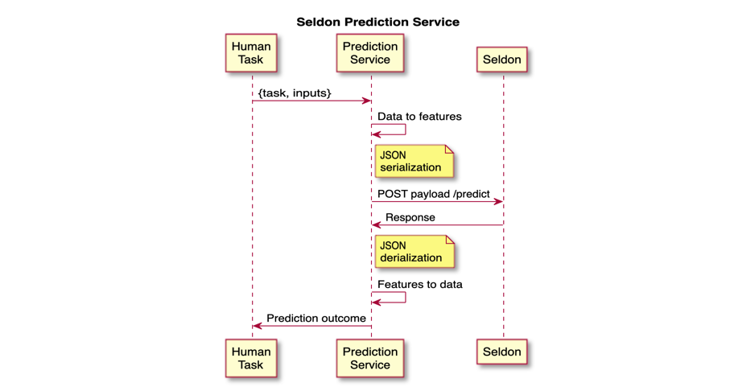

# jBPM Seldon prediction service

## Description

This module contains an example implementation of a prediction service backend which connects to [Seldon](https://www.seldon.io/) model server.

The prediction service allows to set a model's predictions as the Human Task output. If the prediction's `confidence` is higher than the
`confidenceThreshold` then the Human Task is automatically completed.

 The example Human Task has three inputs (`actor`, `level`, `item`) and one output (`approved`).

To configure the service, Seldon's server URL must be specified by passing the location in the format `org.jbpm.task.prediction.service.seldon.url="<PROTOCOL>://<HOST>:<PORT>"`. This can be done either with Java properties, for instance when invoking Business Central with:

```shell
./bin/standalone.sh -Dorg.jbpm.task.prediction.service.seldon.url="http://localhost:5000"
```

Or through a `seldom.properties` file in the classpath with contents:

```properties
org.jbpm.task.prediction.service.seldon.url="http://localhost:5000"
```

Note that the Seldon URL just refers to the hostname, it does not include any endpoint.

The confidence threshold can similarly be set using the key `org.jbpm.task.prediction.service.seldon.confidence_threshold`
either on a `seldon.properties` file, as a Java system property or as a `-D` parameter.

The concrete service implementation can get or change the threshold at runtime using the
`.getConfidenceThreshold()` or `.setConfidenceThreshold()` respectively.   

 ## Installation

 To install the service example simply build the JAR using

 ```
$ mvn clean install
 ```

and place it in jBPM server's classpath.

The example Human Task located in `test/resources/BPMN2-UserTask.bpmn2` can be imported into jBPM to run the example from the unit tests.

### Seldon

To try this prediction service, you will need a Seldon server.

If using OpenShift, you can install a Seldon model written to try this provided example. The model is already packaged as a Docker image (`ruivieira/jbpm-seldon-test-model`, available [here](https://hub.docker.com/repository/docker/ruivieira/jbpm-seldon-test-model)) and to install it on OpenShift you simply run:

```
$ oc new-app ruivieira/jbpm-seldon-test-model
$ oc expose svc/jbpm-seldon-test-model
```

This will create.a Seldon server, with an exposed route which you should make a note of, *e.g.* http://jbpm-seldon-test-model-default.apps-crc.testing/ and provide the URL to the prediction service as specified above.

## Description




The prediction service will take care of connecting Seldon with jBPM's Human Tasks. The core functionality is available in the class `AbstractSeldonPredictionService` for which you must implement a concrete class with your particular model requirements.

An example implementation is provided as `ExampleSeldonPredictionService`. The two main methods that need to be implemented are:

* `buildPredictFeatures`
* `parsePredictFeatures`

`buildPredictFeatures` is responsible for taking the inputs of the Human Task and transforming them into "features"  a list of numerical values) which the Seldon model understands. For instance, turning `String`s into categorical labels or One-Hot encoding categories. Seldon expects a two-dimensional list of features (each element a single prediction), but the prediction service will only provide a single prediction request. As such, the return value will be a `List<List<Double>>` with a single list element.

`parsePredictFeatures` performs the reverse operation, turning Seldon's response into data which the Human Task is expecting.

In the example service, `buildPredictFeatures` transforms `ActorId` and `price` into a list of category and price, that is: `["john", 1913.2] -> [[0.0, 1913.2]]`. The prediction service will then serialise the message, query the prediction and pass the response to `parsePredictFeatures`.

The `/predict` endpoint will be hit with the following `POST` payload:

```json
{
	"data": {
		"ndarray": [[0.0, 1913.2]]
	}
}
```

And a typical response from Seldon would be something like:

```json
{
	"data": {
		"names": ["t:0", "t:1"],
		"ndarray": [[0.71,0.29]]
	},
	"meta":{}
}
```

This gets parsed by the prediction service into a `PredictionResponse` object. The feature names can be accessed using `response.getData().getNames()` and the features with `response.getData().getArray()`.

### Supported response fields

This prediction service supports the following Seldon response data types:

* `ndarray`
* `tensor`
* `tftensor`

`ndarray` response data will be available via `response.getData().getArray()`. `tensor` response data will be available via `response.getData().getTensor()` and `tftensor` will be available via `response.getData().getTfTensor()`.

Although `ndarray` and `tensor` responses will be automatically deserialized into Java native data structures, `tftensor` responses will be available as a `List<Byte>` and further deserialization is left to the user.

Metadata tags from the response are also supported and, if available, can be accessed at `response.getMetadata().getTags()`.
These will be available as a `Map<String, Object>` with tag names as keys and tag values as map values.